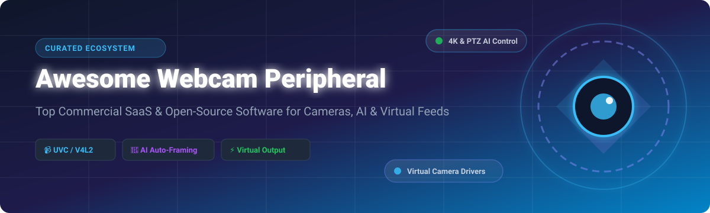

  

<h1 align="center">🎥 Awesome Webcam Peripheral Ecosystem</h1>

  <strong>A Curated List of SaaS Products, Commercial Webcams & Open-Source Projects for Camera Control, Virtual Outputs & AI Video Enhancement</strong>

  
  
  
  
  
  
  

---

## 📌 Introduction & Overview

Welcome to the ultimate resource for **Webcam Peripherals**, **Virtual Camera Drivers**, **Camera Control Hubs**, and **AI Video Utilities**. Whether you are a video streamer, remote worker, Linux enthusiast, or software engineer building custom UVC/V4L2 vision applications, this repository tracks market leaders and open-source tools.

Key focus areas covered in this guide:
- 🎛️ **Hardware & Camera Control:** Direct UVC/V4L2 parameter management (exposure, ISO, pan-tilt-zoom PTZ, white balance).
- 🔄 **Virtual Camera Output:** Drivers and loopback modules for routing modified video frames into Zoom, Teams, Meet, and Discord.
- 🤖 **AI-Powered Enhancements:** Real-time background blur/removal, auto-framing, YOLOX subject tracking, and noise cancellation.
- 📱 **Mobile-as-Webcam:** Turn Android and iOS smartphone cameras into high-definition Linux/Windows USB & Wi-Fi webcams.

---

## 📑 Table of Contents

- [📊 SaaS & Commercial Webcam Ecosystem](#-saas--commercial-webcam-ecosystem)
- [🔓 Open-Source GitHub Projects](#-open-source-github-projects)
- [🛠️ Developer Frameworks & Control Libraries](#-developer-frameworks--control-libraries)
- [🤝 How to Contribute](#-how-to-contribute)
- [📈 Star History](#-star-history)
- [💖 Support](#-support)
- [⚠️ Disclaimer](#%EF%B8%8F-disclaimer)

---

## 📊 SaaS & Commercial Webcam Ecosystem

📈 **Market Size & Sector Dynamics:** The global webcam software and smart camera peripheral market is estimated at **$8.5 Billion (2026)** with an 11.2% CAGR. The sector is **moderately fragmented**, spanning global hardware conglomerates (Microsoft, Dell, Logitech, Anker) alongside specialized camera software innovators (Insta360, Elgato, OBSBOT, NexiGo).

The table below details category-leading commercial products and hardware software hubs, **sorted by parent company size / market valuation (descending)**:

| 🏷️ Product & Brand | 🏢 Manufacturer / Company | 💰 Valuation / Company Size (USD) | 🏷️ Starting Tier Price | 🎁 Free Tier Limit / Software License | 🌟 Key Features & Ecosystem Overview |
| :--- | :--- | :--- | :--- | :--- | :--- |
| **[Microsoft Modern Webcam](https://www.microsoft.com/)** | Microsoft Corporation | **~$3.10 Trillion** | **$69.99** MSRP | Free Microsoft Accessory Center app included; MS Teams free tier (60-min meeting limit) | Compact 1080p HDR USB webcam with auto-framing, status LED, and seamless Microsoft Teams integration. |
| **[Dell UltraSharp Webcam](https://www.dell.com/)** | Dell Technologies | **~$85.0 Billion** | **$199.99** MSRP | Free Dell Peripheral Manager software included forever with hardware purchase | Premium 4K webcam featuring Digital Overlap HDR, AI auto-framing, and Windows Hello IR facial recognition. |
| **[Logitech Brio 4K](https://www.logitech.com/)** | Logitech International | **~$14.5 Billion** | **$199.99** MSRP | Free Logi Tune & Logitech G HUB desktop companion apps included forever | Flagship 4K Ultra HD webcam with RightLight 3 HDR, dual omnidirectional microphones, and Windows Hello. |
| **[Logitech C920](https://www.logitech.com/)** | Logitech International | **~$14.5 Billion** | **$79.99** MSRP | Free Logi Tune app download; full driverless UVC open compatibility | Ubiquitous 1080p webcam with dual stereo mics, autofocus, wide OS support, and hardware H.264 encoding. |
| **[AnkerWork C200](https://www.ankerwork.com/)** | Anker Innovations | **~$6.50 Billion** | **$69.99** MSRP | Free AnkerWork desktop software included forever; AI noise-canceling mic settings free | 2K quad-HD compact webcam with adjustable FOV (65°-95°), dual AI mics, and built-in physical privacy shutter. |
| **[Razer Kiyo Pro](https://www.razer.com/)** | Razer Inc. | **~$2.50 Billion** | **$199.99** MSRP | Free Razer Synapse hub software download forever with manual image controls | Streaming webcam equipped with STARVIS adaptive light sensor, uncompressed 1080p 60FPS, and HDR mode. |
| **[Insta360 Link](https://www.insta360.com/)** | Insta360 (Arashi Vision) | **~$2.00 Billion** | **$299.99** MSRP | Free Insta360 Link Controller desktop application included forever | AI-powered 4K 3-axis gimbal PTZ webcam with gesture control, auto-tracking, DeskView, and Whiteboard mode. |
| **[Elgato Facecam](https://www.elgato.com/)** | Corsair Gaming (Elgato) | **~$1.20 Billion** | **$149.99** MSRP | Free Elgato Camera Hub software included; flash memory settings save to camera | Studio-grade 1080p60 webcam with Sony STARVIS sensor, custom prime lens, and uncompressed low-latency feed. |
| **[OBSBOT Tiny 2](https://www.obsbot.com/)** | REMO Tech (OBSBOT) | **~$150 Million** | **$329.00** MSRP | Free OBSBOT Center software hub & OSC command control; free firmware utility | 4K PTZ webcam with 1/1.5'' CMOS sensor, dual-native ISO, voice control, AI tracking, and gesture triggers. |
| **[NexiGo Iris](https://www.nexigo.com/)** | NexiGo | **~$50 Million** | **$299.99** MSRP | Free NexiGo Software Companion app available without registration | Professional 4K webcam with 1/1.8'' Sony STARVIS sensor, onboard flash memory, and handheld IR remote. |

---

## 🔓 Open-Source GitHub Projects

Open-source software forms the core backbone of virtual video processing, kernel loopback drivers, and hardware control. The table below lists top open-source repositories, **sorted strictly by GitHub Stars_Count (descending)**:

| 📦 Repository | ⭐ Stars_Count | 💻 Main Language | ⚡ Primary Function & Capabilities | 🖥️ Supported OS |
| :--- | :--- | :--- | :--- | :--- |
| **[obsproject/obs-studio](https://github.com/obsproject/obs-studio)** |  | C / C++ | Industry-standard video capture, composition, live streaming suite, and native virtual camera output | Windows, macOS, Linux |
| **[umlaeute/v4l2loopback](https://github.com/umlaeute/v4l2loopback)** |  | C | Universal kernel module for Linux to create virtual V4L2 video devices | Linux |
| **[johnboiles/obs-mac-virtualcam](https://github.com/johnboiles/obs-mac-virtualcam)** |  | C++ / Objective-C | macOS virtual camera plugin for OBS Studio outputting to Zoom/Teams/Meet | macOS |
| **[webcamoid/webcamoid](https://github.com/webcamoid/webcamoid)** |  | C++ / QML | Full-featured cross-platform webcam manager, camera controls, video effects, and virtual camera generator | Windows, Linux, macOS |
| **[CatxFish/obs-virtual-cam](https://github.com/CatxFish/obs-virtual-cam)** |  | C++ | DirectShow virtual camera output plugin for OBS Studio on Windows | Windows |
| **[soyersoyer/cameractrls](https://github.com/soyersoyer/cameractrls)** |  | Python | Advanced camera control application & GTK/CLI interface for V4L2 and Logitech/Kiyo controls | Linux |
| **[webcamoid/akvcam](https://github.com/webcamoid/akvcam)** |  | C | Compliant virtual camera kernel driver for Linux with custom picture fallback | Linux |
| **[letmaik/pyvirtualcam](https://github.com/letmaik/pyvirtualcam)** |  | Python / C++ | Lightweight Python library to send image frames directly into virtual webcams | Windows, macOS, Linux |
| **[webcamoid/akvirtualcamera](https://github.com/webcamoid/akvirtualcamera)** |  | C++ | Virtual camera driver framework for macOS (CoreMedia) and Windows (DirectShow/Media Foundation) | Windows, macOS |
| **[allo-/virtual_webcam_background](https://github.com/allo-/virtual_webcam_background)** |  | Python | Real-time AI background blur and replacement using OpenCV & TensorFlow piping into v4l2loopback | Linux |
| **[azeam/camset](https://github.com/azeam/camset)** |  | Python / PyQt | GUI frontend for `v4l2-ctl` to dynamically adjust exposure, gain, and color while video apps are live | Linux |
| **[Daniel15/WebCamControl](https://github.com/Daniel15/WebCamControl)** |  | C# | Non-exclusive Linux GUI control tool for webcam pan, tilt, zoom, and Insta360 Link settings | Linux |
| **[biglinux/bigcam](https://github.com/biglinux/bigcam)** |  | Shell / Python | All-in-one Linux camera suite with phone-as-webcam over browser, scrcpy, V4L2, and PipeWire | Linux |
| **[elModo7/OBSBOT-Camera-Control-AHK](https://github.com/elModo7/OBSBOT-Camera-Control-AHK)** |  | AutoHotkey | Open-source OSC controller for OBSBOT Tiny 2 with zoom, FOV presets, and gimbal controls | Windows |
| **[chriz-3656/LENSTrace](https://github.com/chriz-3656/LENSTrace)** |  | Python / HTML | Consent-based camera telemetry and privacy auditing tool using browser `getUserMedia` | Cross-platform |
| **[marcorighi/personalsecurewebcam](https://github.com/marcorighi/personalsecurewebcam)** |  | Shell | Lightweight Bash security capture & motion detection tool utilizing `fswebcam` and ImageMagick | Linux |

---

## 🛠️ Developer Frameworks & Control Libraries

If you are developing custom video applications, virtual camera integrations, or camera control scripts, recommended combinations include:

- 🐍 **Windows Programmatic UVC Control:** Use Python libraries like `duvc-ctl` to adjust all 24 camera hardware properties programmatically on Windows.
- 🐧 **Linux Kernel Virtual Camera Integration:** Combine **`v4l2loopback`** or **`akvcam`** for virtual video device nodes with **`cameractrls`** or **`camset`** for parameter tweaking.
- 🎥 **Cross-Platform Frame Streaming:** Use **`pyvirtualcam`** (Python) to stream synthetic frames, AI model output, or OpenCV pipelines directly into conference software.
- 🤖 **OBS Studio AI Filtering:** Integrate native C++ filters like **Auto-Framing-For-OBS** (YOLOX ONNX models) and **AI Background Removal for OBS**.

---

## 🤝 How to Contribute

Contributions are welcome! Please follow these simple guidelines:
1. 🍴 **Fork** the repository.
2. 📝 **Edit** `README.md` to add or update relevant commercial SaaS webcams or open-source repositories.
3. 🏷️ Ensure all Open-Source entries include accurate GitHub links and Stars_Badges linked to stargazers (`https://github.com/owner/repo/stargazers`).
4. 🚀 Submit a **Pull Request** with a brief rationale!

---

## 📈 Star History

---

## 💖 Support

Thank you for visiting and exploring this repository! If you find this curated ecosystem list helpful for your video, streaming, or camera software development needs, please consider supporting the project:

- ⭐ **Star this repository** to help others discover it!
- 🍴 **Fork the repo** to add your own tools, drivers, and recommendations.
- 📢 **Share with colleagues** across video streaming and computer vision communities.
- ☕ **Sponsor / Buy me a coffee:** If you would like to support ongoing open-source curation and project maintenance, check out the [GitHub Sponsor Dashboard](https://github.com/sponsors/ishandutta2007).

  

---

## ⚠️ Disclaimer

- This list is community-curated for informational and educational purposes.
- Virtual camera drivers (`v4l2loopback`, `akvcam`, `akvirtualcamera`) modify video device layers; test in non-production environments.
- Privacy monitoring frameworks like `LENSTrace` must only be used in authorized consent-based auditing environments.

---

  Made with ❤️ for streamers, Linux enthusiasts, remote professionals, and computer vision developers.

